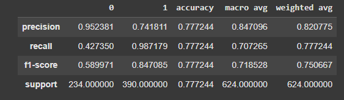

# 👁️‍🗨️ Automated Pneumonia Detection from Chest X-Rays

This project presents a robust computer vision solution for the automated detection of pneumonia using chest X-ray images. Leveraging advanced deep learning techniques, the solution classifies X-ray images as 'NORMAL' or 'PNEUMONIA', aiming to assist medical professionals in rapid and accurate diagnosis.

---

## ✨ Project Overview

The core objective of this project is to develop highly accurate deep learning models capable of distinguishing between normal and pneumonia-infected chest X-rays. This involves comprehensive data preprocessing, aggressive data augmentation, and the application of various Convolutional Neural Network (CNN) architectures—from a custom-built Simple CNN to powerful transfer learning models—followed by thorough evaluation and visualization of performance.

---

## 🚀 Key Features & Methodology

* **Data Acquisition & Preprocessing**:
    * Loaded and prepared a large dataset of chest X-ray images.
    * Performed image resizing and normalization to standardize inputs for neural networks.
* **Extensive Data Augmentation**:
    * Implemented `ImageDataGenerator` with various transformations (rescale, shear, zoom, horizontal flip) to increase dataset diversity and prevent overfitting, crucial for robust medical image analysis.
* **Diverse CNN Model Exploration**:
    * Developed a **Simple CNN** model from scratch to establish a baseline.
    * Utilized **Transfer Learning** with pre-trained state-of-the-art CNN architectures as powerful feature extractors, fine-tuning them for the specific task of pneumonia classification.
    * Explored and compared the performance of multiple prominent transfer learning models: **VGG16**, **ResNet50**, and **DenseNet121**.
* **Model Training & Optimization**:
    * Trained each model with appropriate optimizers and learning rates.
    * Monitored training and validation performance to identify optimal epochs and prevent overfitting.
* **Comprehensive Model Evaluation**:
    * Assessed model effectiveness using critical metrics such as Accuracy, Precision, Recall, F1-Score, and ROC curves.
    * Generated detailed **Confusion Matrices** for each model to understand classification performance across classes.
* **Intuitive Visualizations of Predictions**:
    * Provided custom visualizations showcasing model predictions on individual test images, including correct/incorrect classifications and probability scores.
    * Illustrated overall prediction reliability through bar charts summarizing true/wrong prediction ratios for sample batches.

---

## 🗃️ Dataset

This project utilizes the publicly available **Chest X-Ray Images (Pneumonia)** dataset from Kaggle, which comprises a large collection of labeled chest X-ray images categorized as 'NORMAL' or 'PNEUMONIA'.

* **Dataset Link**: [https://www.kaggle.com/datasets/paultimothymooney/chest-xray-pneumonia](https://www.kaggle.com/datasets/paultimothymooney/chest-xray-pneumonia)

---

## 📈 Visualizations & Results

The `visualizations/` folder contains key graphical insights into the models' performance, allowing for a direct comparison across different architectures:

### Confusion Matrices

These matrices provide a detailed breakdown of correct and incorrect predictions for each class (Normal vs. Pneumonia) for the Simple CNN and the Transfer Learning models:

* **Simple CNN Confusion Matrix:**
    

* **VGG16 Transfer Learning Confusion Matrix:**
    

* **DenseNet121 Transfer Learning Confusion Matrix:**
    

### Example Prediction Visualizations

These images showcase the models' predictions on a set of individual test images, illustrating whether the image was correctly classified as Normal or Pneumonia, often with prediction probabilities:

* **Simple CNN Predictions Example:**
    

* **DenseNet121 Transfer Learning Predictions Example:**
    

* **VGG16 Transfer Learning Predictions Example:**
    

### Batch Prediction Performance Ratios

These bar charts provide an overview of each model's accuracy on a sample batch of test images, showing the ratio of correctly identified vs. wrongly identified cases:

* **Simple CNN Prediction Ratio:**
    

* **DenseNet121 Transfer Learning Prediction Ratio:**
    

---

## 💻 Technologies Used

* **Python**: Core programming language for data manipulation, deep learning, and visualization.
* **TensorFlow / Keras**: For building, training, and evaluating Convolutional Neural Networks.
* **NumPy**: Essential for numerical operations, especially array manipulation for image data.
* **Pandas**: For efficient data loading and preliminary analysis.
* **Matplotlib & Seaborn**: For creating comprehensive and insightful data visualizations.
* **Jupyter Notebook**: For interactive development, experimentation, and presenting the analysis workflow.

---

## 🏃 How to Run the Project (Local Setup)

1.  **Clone the Repository:**
    ```bash
    git clone [https://github.com/AbdullahRandhawa/Pneumonia-Classification-Using-CNN-TransferLearning.git](https://github.com/AbdullahRandhawa/Pneumonia-Classification-Using-CNN-TransferLearning.git)
    cd Pneumonia-Classification-Using-CNN-TransferLearning
    ```
2.  **Install Git LFS (if not already installed):**
    ```bash
    git lfs install
    ```
3.  **Ensure Git LFS is tracking model files:**
    ```bash
    git lfs track "*.h5"
    git lfs track "*.keras"
    ```
    *(These commands only need to be run once per repository. The `.gitattributes` file should already be committed.)*
4.  **Install Required Libraries:**
    It's recommended to use a virtual environment.
    ```bash
    pip install tensorflow keras numpy pandas matplotlib seaborn scikit-learn
    # You might want to create a requirements.txt file in your repo for easier setup:
    # pip install -r requirements.txt
    ```
5.  **Download the Dataset:**
    * Download the "Chest X-Ray Images (Pneumonia)" dataset from Kaggle via the link above.
    * Extract the contents into a directory (e.g., `chest_xray`) within your project folder, ensuring the `train`, `test`, and `val` folders are correctly structured (`train/NORMAL`, `train/PNEUMONIA`, etc.).
6.  **Run the Jupyter Notebook:**
    * Open the `Pneumonia Classification CNN Transfer Learning.ipynb` notebook in Jupyter or VS Code.
    * Run all cells to execute the data loading, model training, evaluation, and visualization steps.

---
